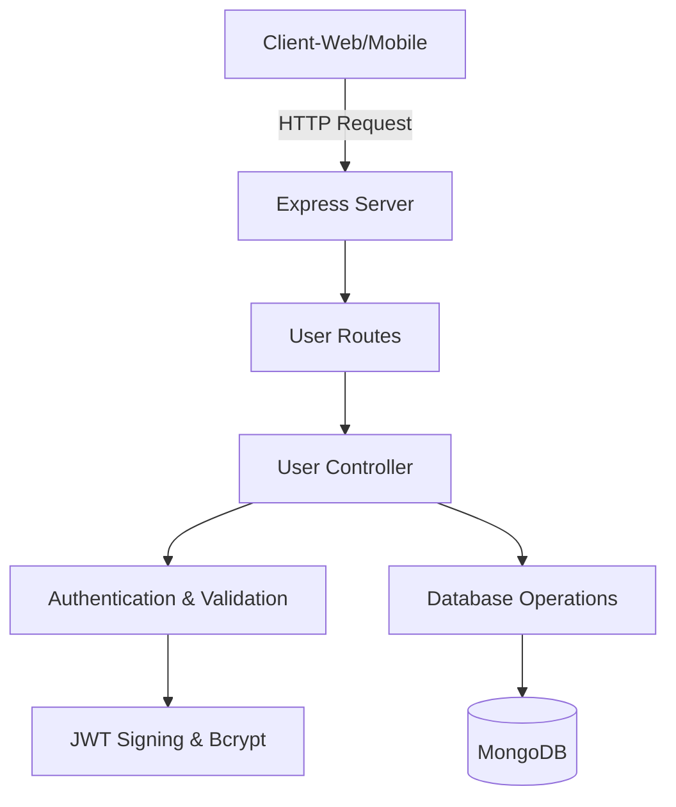

# Chat App Architecture

## Overview

The Chat App is a full-stack application built with Node.js, Express, MongoDB, and TypeScript. It provides RESTful API endpoints for user registration and authentication. The key layers include:

- **Presentation Layer:** Exposes REST endpoints (e.g., `/api/users/register`, `/api/users/login`).
- **Controller Layer:** Contains business logic for user actions such as login and registration.
- **Model/Database Layer:** Defines data structures (e.g., User schema) and communicates with MongoDB using Mongoose.
- **Configuration Layer:** Handles environment configuration and database connectivity.
- **Utilities & Middleware:** Provide supporting functionality such as input validation (express-validator), password hashing (bcrypt), and token generation (JWT).

## Key Components

1. **Server Setup (`server.ts`):**
   - Entry point of the application.
   - Configures middleware (CORS, JSON parser) and initializes routes.

2. **Routes (`userRoutes.ts`):**
   - Defines the endpoints for user operations.
   - Connects HTTP methods to controller functions.

3. **Controllers (`userController.ts`):**
   - Implements the actual logic for user login and registration.
   - Uses JWT for authentication and bcrypt for password management.

4. **Models (`User.ts`):**
   - Defines the user schema using Mongoose.
   - Represents user data stored in MongoDB.

5. **Configuration (`db.ts`):**
   - Manages database connectivity.
   - Provides helper functions to connect and disconnect the MongoDB database.

6. **Utilities:**
   - Provide additional helper functions including token signing and password hashing.

## Application Flow: Login Example

1. **Client Request:**  
   A client sends a POST request to `/api/users/login` with the user's email and password.

2. **Routing:**  
   The request is routed to the user controller via `userRoutes.ts`.

3. **Controller Processing:**  
   In `userController.ts`, the controller:
   - Validates the user credentials.
   - Checks the database for the user.
   - Uses bcrypt to compare passwords.
   - Generates a JWT token upon successful authentication.

4. **Response:**  
   The controller responds with user details and an authentication token, or an error message if authentication fails.

## High-Level Diagram

Below is a Mermaid diagram that summarizes the high-level components and flow:

## Conclusion

This architecture emphasizes the separation of concerns:
- The **server** mainly configures middleware and routes.
- **Controllers** contain business logic.
- **Models** handle data persistence and retrieval.
- **Configuration files** (e.g., for DB connections and environment variables) ensure flexibility across environments.

This modular design improves maintainability, scalability, and security, while keeping concerns neatly separated.